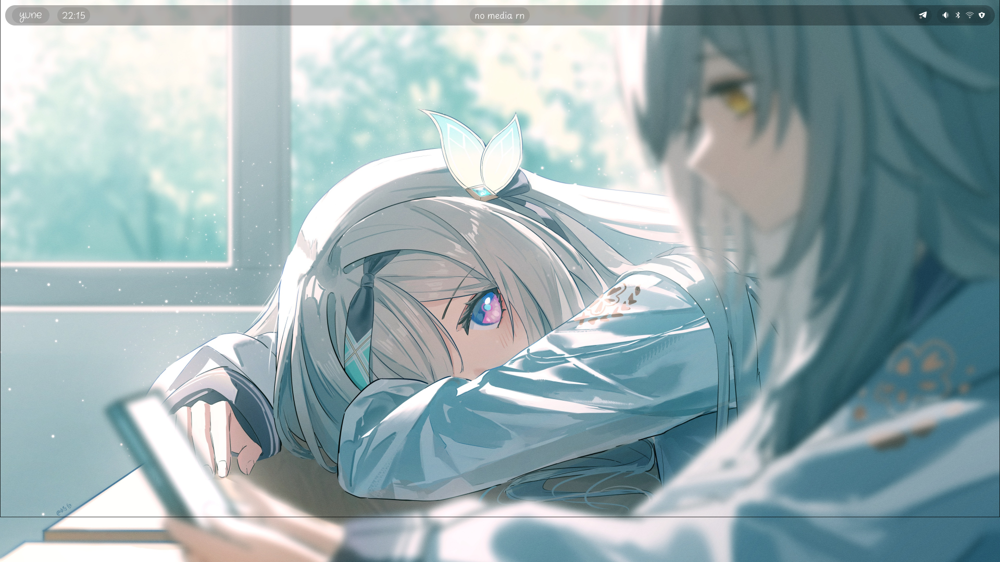
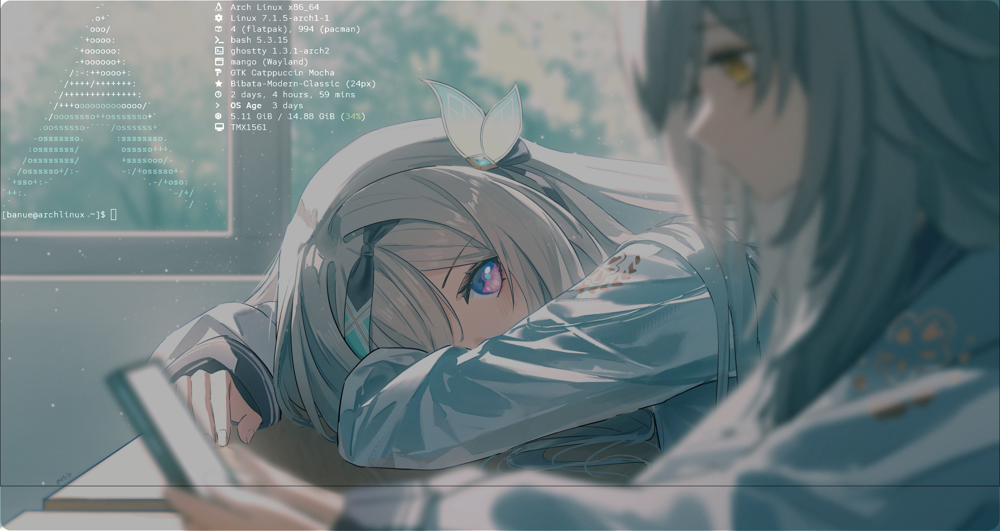
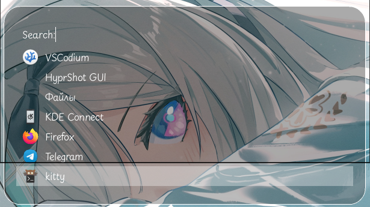

# yune

> Minimal MangoWM config — clean lines, calm palette, tiled workflow.

## Screenshots

| Desktop | Terminal | App launcher |
|---|---|---|
|  |  |  |

## Requirements

MangoWM, vibepanel, ghossty, fuzzel, cava, bibata-cursor-theme-bin
Fonts: Crafty Girls, Playpen Sans Light, Red Hat Mono Light


## Installation

```bash
git clone https://github.com/banuee/yune-mangowm-dots.git ~/.config/yune
cd ~/.config/yune
./install.sh
```

> To install wallpaper place it to ~/Pictures and replace my nickname (banue) to your in ~/.config/mango/Autostart.sh


> ⚠️ Review `install.sh` before running — it may symlink over your existing configs.

## Structure

```
yune/
├── config/        # configs
├── assets/         # screenshots
├── fonts/          # fonts
├── wallpapers      # wallpapers
└── install.sh
```

## Keybinds

### System
| Key | Action |
|---|---|
| `Super + R` | reload config |
| `Super + M` | quit WM |
| `Super + Q` | close window |

### Launch Apps
| Key | Action |
|---|---|
| `Super + L` | app launcher (fuzzel) |
| `Super + T` | terminal (ghostty) |
| `Super + B` | browser (firefox) |
| `Super + E` | file manager (nemo) |
| `Super + J` | steam |
| `Alt + F4` | power menu |
| `Alt + P` | msnap GUI |
| `Shift + Print` | screenshot region |
| `Alt + Print` | screen record region (toggle) |
| `Ctrl + B` | clipboard history (cliphist) |

### Media / Special Keys
| Key | Action |
|---|---|
| `XF86AudioRaiseVolume` | volume +5% |
| `XF86AudioLowerVolume` | volume -5% |
| `XF86AudioMute` | toggle mute |
| `XF86AudioMicMute` | toggle mic mute |
| `XF86MonBrightnessUp` | brightness +10% |
| `XF86MonBrightnessDown` | brightness -10% |

### Window Focus
| Key | Action |
|---|---|
| `Super + Tab` | focus next window |
| `Super + A` | focus left |
| `Super + D` | focus right |
| `Super + W` | focus up |
| `Super + X` | focus down |

### Move & Resize
| Key | Action |
|---|---|
| `Super + Shift + A` | swap window left |
| `Super + Shift + S` | swap window right |
| `Super + Shift + ←/→/↑/↓` | resize window |
| `Ctrl + Shift + ←/→/↑/↓` | move window |
| `Super + LMB` | drag window |
| `Super + RMB` | resize window (mouse) |

### Window State
| Key | Action |
|---|---|
| `Super + V` | toggle floating |
| `Super + F` | maximize screen |
| `Super + Shift + F` | fullscreen |
| `Alt + Shift + F` | fake fullscreen |
| `Super + G` | toggle global |
| `Super + I` | minimize |
| `Super + Shift + I` | restore minimized |
| `Super + O` | toggle overlay |
| `Alt + Z` | scratchpad |
| `Alt + Tab` | toggle overview |

### Tags (Workspaces)
| Key | Action |
|---|---|
| `Alt + 1–9` | switch to tag 1–9 |
| `Super + Right/Left` | switch tag right/left |
| `Ctrl + Right/Left` | switch tag (only if has clients) |
| `Ctrl + Super + Right/Left` | move window to tag right/left |

### Layout
| Key | Action |
|---|---|
| `Super + N` | cycle layout |
| `Alt + E` | set scroller proportion to 1.0 |
| `Alt + X` | cycle proportion preset |

## Credits

- [MangoWM](https://github.com/DreamMaoMao/mango)
- Wallpaper: *(credit artist if applicable)*

## License

MIT
